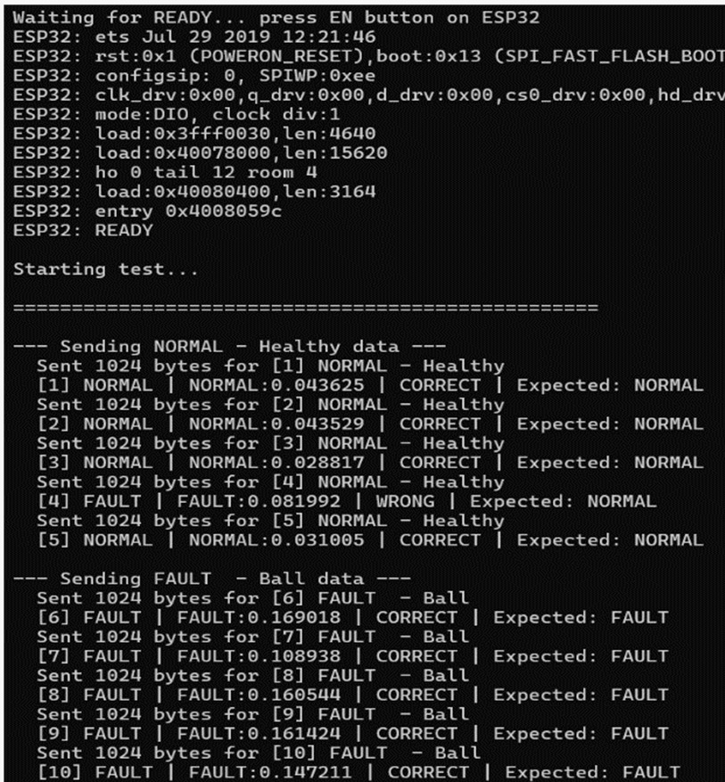
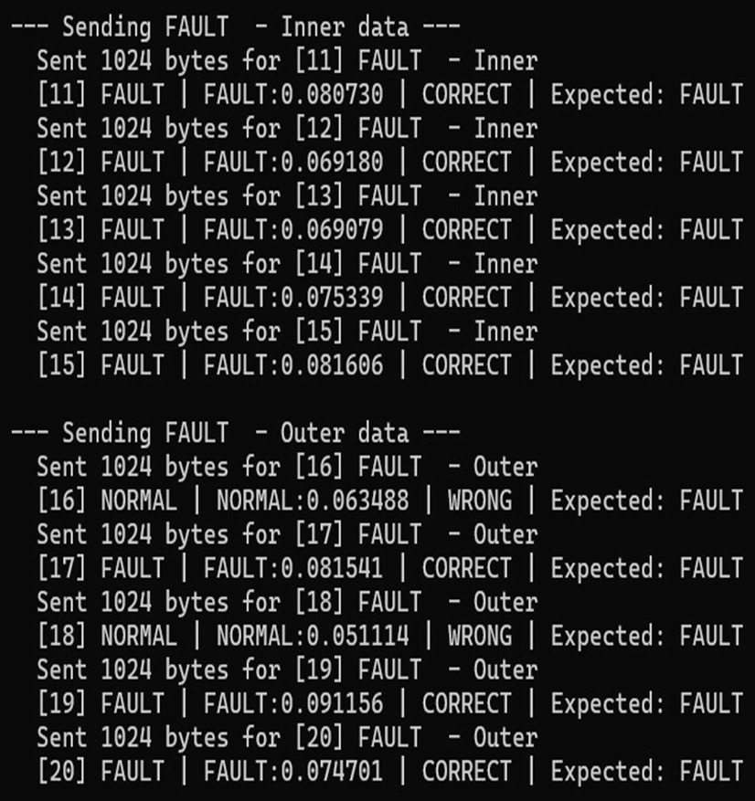

# Real-Time Motor Fault Detection Using Unsupervised Autoencoders on ESP32 Edge Devices

## Overview

This project presents a TinyML-based motor fault detection system using an unsupervised autoencoder deployed on an ESP32 microcontroller. The model is trained using healthy motor data from the Case Western Reserve University (CWRU) Bearing Dataset and detects abnormal motor conditions based on reconstruction error. The trained model is converted to TensorFlow Lite and deployed on the ESP32 for real-time edge inference.

---

## Features

- TinyML-based motor fault detection
- Unsupervised autoencoder trained on healthy motor data
- TensorFlow Lite model deployment on ESP32
- Real-time Normal/Fault prediction
- Reconstruction error (MSE)-based anomaly detection
- Lightweight edge AI implementation

---

## Tech Stack

- Python
- TensorFlow
- TensorFlow Lite
- C++
- Arduino IDE
- ESP32

---

## Repository Structure

```text
Arduino/
    ESP32_Motor_AI.ino
    model.h

Python/
    train.py
    retrain.py
    train_esp32_compatible.py
    convert_quantized.py
    detect.py
    detect_novelty.py
    detect_org.py
    send_to_esp32.py

Images/
    system_workflow.jpeg
    loss_distribution.jpeg
    confusion_matrix.jpeg
    result1.jpeg
    result2.jpeg
```

---

## Workflow

1. Prepare and preprocess the CWRU motor bearing dataset.
2. Train the autoencoder using healthy motor samples.
3. Convert the trained model into TensorFlow Lite format.
4. Deploy the quantized model on the ESP32.
5. Compute the reconstruction error (MSE) for each input sample.
6. Compare the reconstruction error with a predefined threshold.
7. Classify the input as **Normal** or **Fault**.

---

## System Architecture


The workflow illustrates data preprocessing, model training, TensorFlow Lite conversion, ESP32 deployment, and real-time fault detection using reconstruction error.

---

## Loss Distribution


The reconstruction error distribution clearly separates healthy motor samples from faulty motor samples, enabling effective anomaly detection using a predefined threshold.

---

## Confusion Matrix


The confusion matrix demonstrates the performance of the selected threshold in distinguishing healthy and faulty motor conditions.

---

## Sample Detection Results

### Healthy Motor vs Ball Fault



This result shows the ESP32 successfully distinguishing **healthy motor data** from **ball fault** data using the deployed TinyML model.

---

### Inner Race Fault vs Outer Race Fault



This result demonstrates the model's ability to identify different fault conditions, including **inner race fault** and **outer race fault**, using reconstruction error-based anomaly detection.

---

## ESP32 Deployment

The trained TensorFlow Lite model is deployed on the ESP32 microcontroller for on-device inference. Incoming motor data is processed in real time, and each sample is classified as **Normal** or **Fault** based on its reconstruction error.

---

## Future Improvements

- Support additional bearing fault categories
- Optimize the model for faster inference and lower memory usage
- Develop a web or mobile dashboard for monitoring
- Implement adaptive threshold selection for improved robustness

---

## Author

**Raghul V R**

B.Tech – Electronics and Communication Engineering

Amrita Vishwa Vidyapeetham
